```
██████╗  █████╗ ██████╗ ███████╗██████╗  ██████╗ ██████╗ ████████╗
██╔══██╗██╔══██╗██╔══██╗██╔════╝██╔══██╗██╔═══██╗██╔══██╗╚══██╔══╝
██████╔╝███████║██████╔╝█████╗  ██████╔╝██║   ██║██████╔╝   ██║
██╔══██╗██╔══██║██╔══██╗██╔══╝  ██╔═══╝ ██║   ██║██╔══██╗   ██║
██████╔╝██║  ██║██║  ██║███████╗██║     ╚██████╔╝██║  ██║   ██║
╚═════╝ ╚═╝  ╚═╝╚═╝  ╚═╝╚══════╝╚═╝      ╚═════╝ ╚═╝  ╚═╝   ╚═╝

        zero third-party dependencies. always.
```

# bareport

**A zero-dependency network security assessment tool, built entirely on the Go standard library.**

Built for Hackathon Raptors' [Zero Dependency](https://zerodepshack.com/) hackathon — Track C, Web & Network.


[](https://github.com/sadiapeerzada/Bareport/actions/workflows/ci.yml)


```
$ cat go.mod
module bareport

go 1.22.2
```

No `require` lines. Ever. And the binary can prove it about itself — see [Signature features](#signature-features).

> Every third-party package is a small act of trust extended to a stranger. Bareport extends none — and it checks itself on every run to make sure that stays true.

---

## Table of contents

It's a long README because the rules score the receipts, not the pitch — jump to what you need:

- [Track & scope](#track--scope)
- [At a glance](#at-a-glance)
- [What is bareport?](#what-is-bareport)
- [Why does it exist?](#why-does-it-exist)
- [Key features](#key-features)
- [Signature features](#signature-features)
- [Quick demo](#quick-demo)
- [Judge walkthrough](#judge-walkthrough)
- [Installation](#installation)
- [Quick start](#quick-start)
- [Common commands](#common-commands)
- [Example output](#example-output)
- [Security findings](#security-findings)
- [Risk scoring](#risk-scoring)
- [Reports](#reports)
- [Baseline / drift detection](#baseline--drift-detection)
- [Continuous mode (`--watch`)](#continuous-mode---watch)
- [Scan profiles](#scan-profiles)
- [Zero-dependency philosophy](#zero-dependency-philosophy)
- [Demo environment](#demo-environment)
- [Testing](#testing)
- [Performance](#performance)
- [Limitations](#limitations)
- [Troubleshooting](#troubleshooting)
- [Project structure](#project-structure)
- [Security / authorized use](#security--authorized-use)
- [Contributing](#contributing)
- [License](#license)

## Track & scope

**Track:** C — Web & Network. Bareport is a concurrent TCP/UDP scanner, a TLS/HTTP/DNS inspector, and a local web dashboard, built entirely on `net`, `net/http`, and `crypto/tls`. That's Track C's brief directly: concurrent connections handled without a framework, protocols that interoperate with real clients and servers, stdlib-only networking, an honestly documented concurrency model.

It also brushes up against Track F's spirit in one place: the `--verify-zero-dep` self-audit below is the kind of "I didn't know you could do that without a package" moment Track F rewards under Innovation. The submission is filed under Track C, not F — no dual-track claim — but it's worth knowing where that slice of the Innovation score comes from.

## At a glance

The numbers a skim gets you — every one of them pulled from a section below, nothing aspirational.

| Metric | Value |
|---|---|
| Third-party runtime dependencies | 0 — verified by `make deps-proof`, and at runtime by `bareport --verify-zero-dep` |
| STDLIB substitutions documented | 19, each with its own rationale |
| Cold clone → first scan | ~25s, zero network access required |
| Cross-package test coverage | 84.1% (`-coverpkg=./...`) |
| Race detector | Clean (`go test -race`) on every concurrent path |
| Reproducible build | Byte-identical across two independent builds |
| Integration tests | 12/12 passing — real binary vs. real servers |
| Report formats | Terminal · JSON · CSV · SARIF 2.1.0 · self-contained HTML |
| Platforms | Linux (run-verified) · macOS · Windows (build-verified) |

### Where the proof lives

Mapped to how the submission gets scored:

| Scored on (weight) | What to look at |
|---|---|
| Functionality & Usefulness (35%) | [Quick demo](#quick-demo), [Example output](#example-output) — real findings against real listening services, five report formats |
| Zero-Dependency Craft (30%) | `make deps-proof`, `bareport --verify-zero-dep`, [STDLIB.md](./STDLIB.md) (19 documented substitutions), [Zero-dependency philosophy](#zero-dependency-philosophy) |
| Code Quality & Idiom (25%) | The package split in [Project structure](#project-structure), `go test -race` clean, [ARCHITECTURE.md](./ARCHITECTURE.md) |
| Innovation (10%) | The self-verifying `--verify-zero-dep` runtime audit (also live in the HTML report/dashboard, not just the CLI), bareport scanning its own `--serve` dashboard, a raw-ANSI live terminal dashboard with no TUI library, a risk model that's transparent instead of borrowed from CVSS, with an additive per-category breakdown |

> [!TIP]
> Two bonus challenges this build has already cleared, one still open. **STDLIB Log (+3)** — STDLIB.md documents 19 substitutions with rationale, past the 10-entry bar. **Reproducible Build (+5)** — `make verify-reproducible` proves byte-identical output, and the two real hashes are published in [Zero-dependency philosophy](#zero-dependency-philosophy). **Package Killer (+3)** is still open — see the [Package Killer bundle](./STDLIB.md#package-killer-bundle) in STDLIB.md.

---

## What is bareport?

Bareport discovers hosts, scans ports, fingerprints services, inspects
TLS/HTTP/DNS, runs a deterministic security-findings engine, computes a
transparent risk score, and generates terminal/JSON/CSV/SARIF/HTML
reports — plus baseline/drift comparison between two scans, and a
runtime audit of its own dependency graph. All of it, with zero
third-party runtime dependencies.

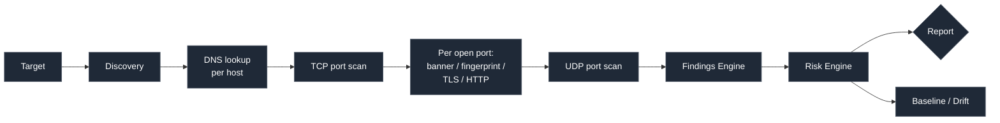

This is the real per-host order `scanner.Run` (`scanner/orchestrate.go`) executes: discovery, then (per host) a DNS lookup, then the TCP port scan, then banner/fingerprint/TLS/HTTP enrichment on whatever ports came back open, then the UDP probe pass if `--udp-ports` was given — repeated per host, then the findings engine and risk engine run once over the completed report. Full package-by-package breakdown and design decisions: **[ARCHITECTURE.md](./ARCHITECTURE.md)**.

## Why does it exist?

Dependency-heavy security tooling introduces exactly the kind of
supply-chain surface it's supposed to help you reduce — a scanner with
forty transitive dependencies is itself forty things that need
trusting. Bareport is the other end of that trade-off: everything it
does is built from the Go standard library alone, so the entire attack
surface of the tool itself is auditable in one sitting.

That's a claim, not just a design goal — see [Zero-dependency
philosophy](#zero-dependency-philosophy) for how it's proven at build
time and run time, **[STDLIB.md](./STDLIB.md)** for the
package-by-package substitution rationale, or run `bareport
why-zero-dep` for the short version from the CLI itself.

## Key features

- **Concurrent TCP port scanning** (worker pool, CIDR/host-file targets, port ranges/presets) and **UDP scanning** with an honestly-documented `open|filtered` heuristic
- **TCP-based host discovery** — [documented tradeoff](./ARCHITECTURE.md#design-decisions-worth-calling-out), not a "real" ICMP ping
- **Banner grabbing and TTL-based OS fingerprinting** (Linux only)
- **TLS/certificate inspection, HTTP security-header audit, DNS reconnaissance** (MX/TXT/SPF/DMARC)
- **Deterministic security findings** with evidence and remediation — no AI, no external API, no fabricated vulnerabilities, including information disclosure (Server-header version leaks), insecure cookie flags (missing `HttpOnly`/`Secure`), and — opt-in only, via `--admin-paths` — unauthenticated admin-endpoint exposure
- **A transparent, documented risk score** — explicitly not CVSS — plus a **risk score breakdown by category** (Network/TLS/HTTP/DNS), shown in the HTML report and web dashboard
- **An attack-surface view** — every open port per host, with its worst finding severity, in the HTML report and web dashboard
- **Five report formats** — terminal, JSON, CSV, SARIF, self-contained HTML
- **Baseline/drift detection** (`bareport diff`) — new/closed ports, new/removed services, TLS changes, risk delta
- **Continuous mode** (`--watch --interval <duration>`) — re-scans on a timer and prints drift live as it happens, using the same diff engine as `bareport diff`, without two manual `--save` runs
- **Three scan profiles** (`--profile quick|security|full`)
- **A live, in-place-redrawing terminal dashboard** (raw ANSI, no TUI library)
- **A local web dashboard** (`--serve`) — zero JS/CSS framework, surfacing the same risk breakdown, attack surface, and zero-dependency self-audit status as the HTML report
- **Zero-configuration LAN scanning** via `--local-network`
- **A runtime self-audit** (`--verify-zero-dep`) that proves the zero-dependency claim on every run, not just at build time — the same live result is also shown in the HTML report and dashboard, not just the CLI
- **CI-friendly, documented exit codes**, wired into a GitHub Actions workflow (`.github/workflows/sarif-scan.yml`) that scans a local demo target and uploads the results to GitHub Code Scanning

## Signature features

Two things in this build exist purely to make the zero-dependency claim harder to fake, not just easier to state — both are demo'd live, not only documented.

### `bareport --verify-zero-dep` — the tool audits itself

`make deps-proof` proves zero dependencies at build time. `--verify-zero-dep` proves it at *run* time, every time the binary executes — by cross-checking a snapshot of bareport's own import graph, captured once ahead of time, rather than by shelling out to `go list` itself:

1. `go run tools/gen_selfaudit.go` (or `make selfaudit-manifest`) runs *once*, ahead of building the release binary: it reads `go.mod`, walks bareport's own import graph (`go list -deps .`), and captures the real Go standard library's package list (`go list std`) — writing all three into `selfaudit/manifest_generated.go` as a generated Go source file.
2. That file is compiled directly into the binary, so `--verify-zero-dep` needs no `go` toolchain, no `os/exec`, and no network access at runtime to do its check — it reads its own embedded tables.
3. At runtime, `selfaudit.Verify()` cross-checks every import in that embedded graph against the embedded stdlib table (also treating bareport's own packages, and anything under `vendor/`, as fine — see `selfaudit/selfaudit.go`'s doc comment for why).
4. Prints a pass/fail report and exits non-zero the moment it finds anything outside stdlib.

This is a deliberate trade-off, not a shortcut: a live `go list -deps` call would need the Go toolchain installed just to run the binary's own self-check, breaking the "single compiled artifact, nothing else needed" story the rest of this README leans on. The cost is that the check reflects the import graph *as of the last `make selfaudit-manifest` run* — anyone changing bareport's own imports needs to regenerate that file before `--verify-zero-dep` reflects the change (see [Contributing](#contributing)).

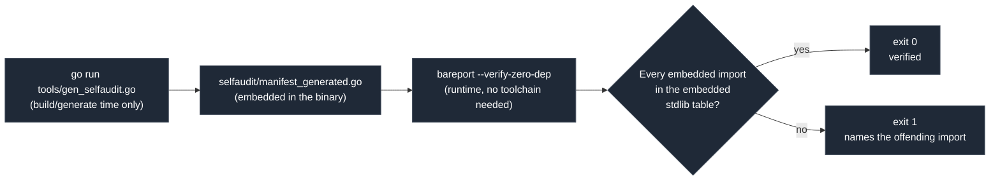

```
$ bareport --verify-zero-dep
bareport zero-dependency self-audit

  go.mod:               module bareport, go 1.22.2, 0 require lines
  imports walked:       156
  outside stdlib:       0

VERIFIED — zero third-party runtime dependencies
$ echo $?
0
```

(The "imports walked" count grows as the codebase does — the number
above is illustrative of the current import graph, not a fixed value;
run the command yourself for the live figure.)

The claim stops being "trust the README" and becomes "the binary checks itself, on every run, and shows its work."

### Self-scan — bareport audits its own dashboard

Since `--serve` is itself a network service, bareport can point at itself:

```bash
./bareport --targets 127.0.0.1 --serve &
./bareport --targets 127.0.0.1 --ports <dashboard-port>
```

The findings engine doesn't know or care that the target happens to be written by the same person running the scan — so real findings come back (missing security headers, whatever the dashboard's own HTTP surface actually exposes). Whatever fires gets fixed, and the fix is verified by re-running the same scan. It's the deterministic-findings claim, closed in a loop on the tool that made it.

## Quick demo

```bash
go run demo-targets/run-all.go &     # six local demo servers, no real targets needed
./bareport --targets 127.0.0.1 --ports 8081,8443,8444,2222,8090,9999 --udp-ports 9999 --skip-discovery
./bareport --verify-zero-dep         # the self-audit, right after the scan
```

Full narrated walkthrough (problem → zero-dep proof → scan → findings →
HTML report → drift → CI/SARIF → self-audit): **[DEMO.md](./DEMO.md)**.

## Judge walkthrough

The fastest path through everything this submission is scored on, in order:

1. `git clone` → `make build` → confirm the ~25s cold-start claim in [Installation](#installation).
2. `bareport --verify-zero-dep` — the binary proves the zero-dependency claim itself. Check `echo $?` is `0`.
3. `go run demo-targets/run-all.go &` — spin up the six local demo servers, no real targets needed.
4. `./bareport --targets 127.0.0.1 --ports 8081,8443,8444,2222,8090,9999 --udp-ports 9999 --skip-discovery` — a real scan against real listening services. Compare against [Example output](#example-output).
5. `./bareport --targets 127.0.0.1 --ports 8081,8443,8444 --html report.html` — open `report.html` offline to confirm it's genuinely self-contained (kill your network connection first, if you want to be thorough).
6. `bareport --targets 127.0.0.1 --ports 8081,8443,8444 --save baseline.json`, stop `demo-targets/tcp-echo.go`, re-scan and save as `current.json`, then `bareport diff baseline.json current.json` — see [Baseline / drift detection](#baseline--drift-detection) fire on a real change.
7. `bareport --targets 127.0.0.1 --ports 8081,8443,8444 --format sarif > report.sarif` — confirm valid SARIF 2.1.0 output, e.g. by uploading to a repo's Security tab.
8. `make test-race && make integration-test` — race-clean, 12/12 integration tests passing.
9. (Optional, Innovation) Point bareport at its own `--serve` dashboard — see [Self-scan](#self-scan--bareport-audits-its-own-dashboard).

Every step above is copy-pasteable from this README as written; none of them need a config file or network access beyond loopback.

## Installation

```bash
git clone <this-repo>
cd bareport
make build       # -> ./bareport
```

Builds clean on Linux, macOS, and Windows (`GOOS=darwin GOARCH=arm64`,
`GOOS=windows GOARCH=amd64`, and native `linux/amd64` cross-compiles —
developed and tested primarily on Linux, so macOS/Windows are
build-verified, not run-verified).

Timed end-to-end from a genuinely cold state (`git clone` into a fresh
directory, empty `GOCACHE`, through `make build` through a real first
scan producing output): **~25 seconds**, no network access required
anywhere in that path.

## Quick start

```bash
./bareport --targets example.com                 # scan and print a report
./bareport --targets example.com --explain        # scan with full finding explanations
./bareport --targets example.com --profile quick  # fast triage
./bareport --verify-zero-dep                      # confirm zero third-party deps, live
```

### Common commands

| Command | Does |
|---|---|
| `bareport --targets <host/CIDR/file>` | run a scan |
| `bareport --targets <t> --json > out.json` | machine-readable report |
| `bareport --targets <t> --html out.html` | self-contained HTML report |
| `bareport --targets <t> --format sarif > out.sarif` | SARIF for CI code-scanning |
| `bareport --targets <t> --serve` | local web dashboard |
| `bareport --targets <t> --save state.json` | save scan state for later diffing |
| `bareport diff baseline.json current.json` | drift report between two saved scans |
| `bareport why-zero-dep` | print the zero-dependency substitution list |
| `bareport --verify-zero-dep` | runtime self-audit against the embedded stdlib list |
| `bareport --targets 127.0.0.1 --ports <dashboard-port>` | audit bareport's own `--serve` dashboard |
| `bareport --targets <t> --admin-paths admin,manage` | opt-in: also probe the listed paths for an unauthenticated admin endpoint (off by default — see [Security findings](#security-findings)) |

## Example output

```
$ bareport --targets 127.0.0.1 --ports 8081,8443,8444 --skip-discovery --no-color
HOST       PORT  PROTO  STATE  SERVICE  SEVERITY  NOTES
127.0.0.1  8444  tcp    open   http     critical  certificate expired 729 day(s) ago (2024-08-30) (+7 more)
127.0.0.1  8081  tcp    open   http     warning   missing security header: Strict-Transport-Security (+4 more)
127.0.0.1  8443  tcp    open   http     warning   missing security header: Strict-Transport-Security (+6 more)

Summary: 1 host(s) scanned, 1 alive, 3 port(s) open, 16 warning(s), 1 critical(s) — duration 4.5s

╭───────────────────────────────────────────────╮
│         BAREPORT SECURITY ASSESSMENT          │
├───────────────────────────────────────────────┤
│ Target:                           127.0.0.1   │
│ Hosts:                                     1  │
│ Open Ports:                                3  │
│ Services:                                  3  │
│ Findings:                                 24  │
│ Risk Score:                        100 / 100  │
│ Risk Level:                         CRITICAL  │
├───────────────────────────────────────────────┤
│ CRITICAL:                                  1  │
│ HIGH:                                      0  │
│ MEDIUM:                                   11  │
│ LOW:                                       8  │
│ INFO:                                      4  │
╰───────────────────────────────────────────────╯
$ echo $?
3
```

(Real output from this exact command against `demo-targets/run-all.go`. The certificate's expired-729-days-ago date and the exact duration are relative to when you run it — `expired-https.go` always backdates its certificate to roughly two years before "now," so the day count stays close to 729 but the calendar date shown will match whatever day you actually run the scan.)

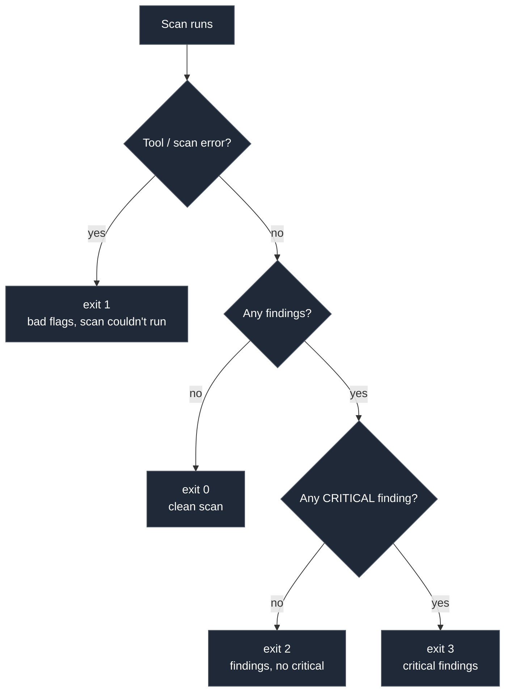

Makes `bareport` usable as a CI gate: `bareport --targets $HOST || fail`.
Supersedes an earlier, simpler 0/1/2 scheme — documented here rather
than silently changed, since exit code `1` now means tool error, not
"warnings present."

## Security findings

Every finding comes from a deterministic rule reading data the scanner
already collected — an expired cert, a missing header, a cleartext
banner, a version-bearing `Server` header, a cookie missing
`HttpOnly`/`Secure` — never a guess, never a fabricated vulnerability.
Rule sets live in `findings/tls.go`, `findings/http.go`,
`findings/network.go`, `findings/dns.go`, each with the evidence it
requires before firing. One rule, `HTTP-EXPOSED-ADMIN-ENDPOINT`, is
opt-in rather than automatic: it only fires for paths passed via
`--admin-paths` (see [Common commands](#common-commands)), because an
always-on guess-common-paths probe would misfire against any server
whose catch-all route answers every path with 200.

```
bareport --targets example.com --explain
```

```
[MEDIUM] Missing HTTP Strict Transport Security header

What:
The response does not include a Strict-Transport-Security header.
Without it, browsers do not enforce HTTPS-only access on their own,
leaving room for a downgrade to plain HTTP on future visits (e.g. via
a stripped link or a captive-portal-style interception).

Evidence:
Response from https://example.com:443/ (status 200) did not include a
Strict-Transport-Security header.
Host: example.com
Port: 443

Recommendation:
Send `Strict-Transport-Security: max-age=<seconds>; includeSubDomains`
(add `preload` once ready for browser preload lists) on every HTTPS
response.
```

(Verbatim shape and wording from `report.WriteFindingExplanations` and the `HTTP-MISSING-HSTS` rule in `findings/http.go` — this rule is `MEDIUM`, not `HIGH`; severities are set per rule in `findings/*.go`, not uniformly by finding type.)

## Risk scoring

The **Bareport Risk Score** is deterministic, documented, and
explicitly **not CVSS**:

| Severity | Points | | Score | Level |
|---|---|---|---|---|
| CRITICAL | 40 | | 0–19 | LOW |
| HIGH | 20 | | 20–39 | MODERATE |
| MEDIUM | 10 | | 40–69 | HIGH |
| LOW | 5 | | 70–100 | CRITICAL |
| INFO | 0 | | *(capped at 100)* | |

Bareport doesn't implement CVSS's vector/metric model and never claims to.

The same score is also available broken down by category — Network,
TLS, HTTP, DNS — via `risk.Breakdown`, which groups findings by their
ID prefix (e.g. `TLS-EXPIRED-CERT` → TLS) and sums each category's raw
weighted points using the exact same severity weights above. It's a
second, additive view over the identical arithmetic, not a second
scoring model — summing every category's points reproduces the
overall score for any scan under the 100-point cap. Shown in the HTML
report and web dashboard, not currently in `--json`/`--save` output.

## 📸 Dashboard & Reports

Bareport includes a local dashboard for reviewing scan results, risk scoring, security findings, open ports, filtering, and live scan activity.

<table>
<tr>
<td width="50%">

**Dashboard Overview**

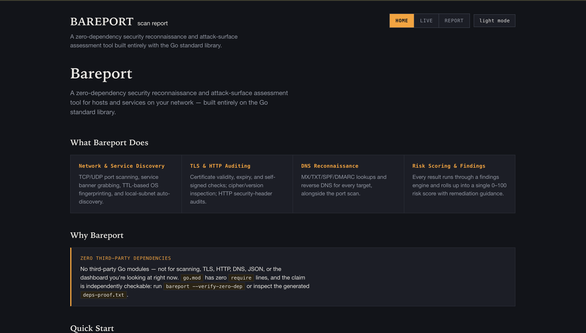

</td>
<td width="50%">

**Risk Overview**

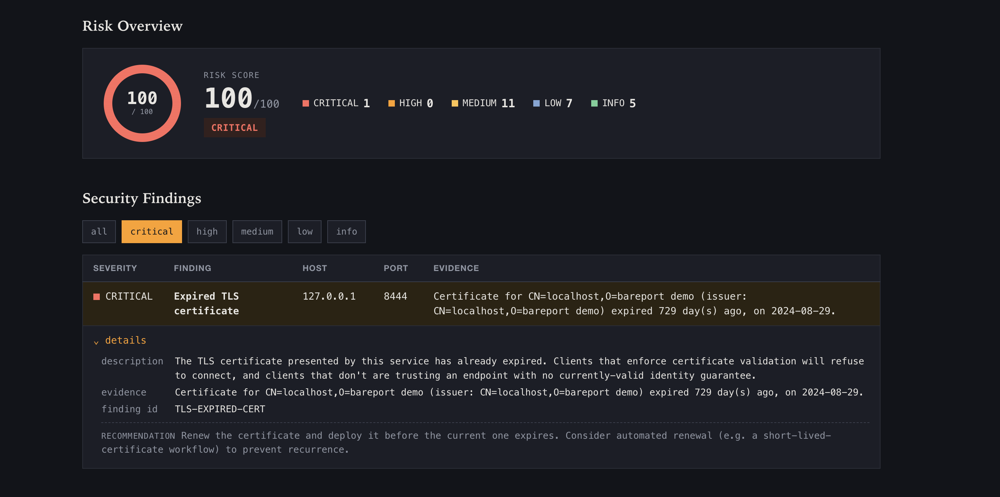

</td>
</tr>

<tr>
<td width="50%">

**Security Findings**

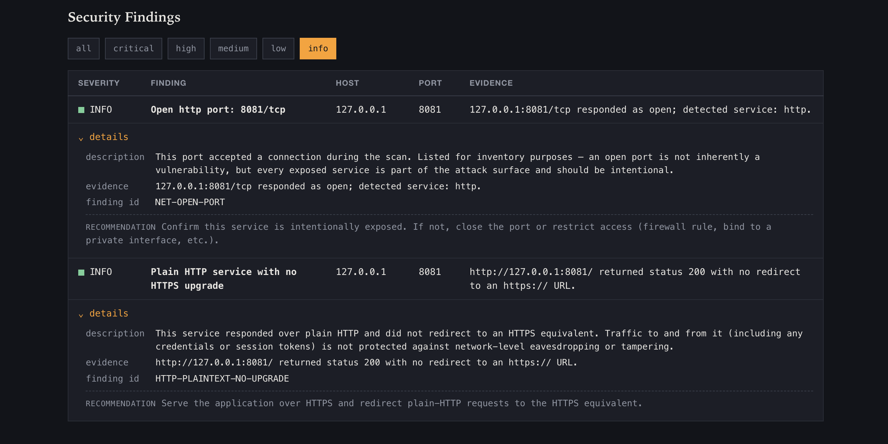

</td>
<td width="50%">

**Open Ports & Services**

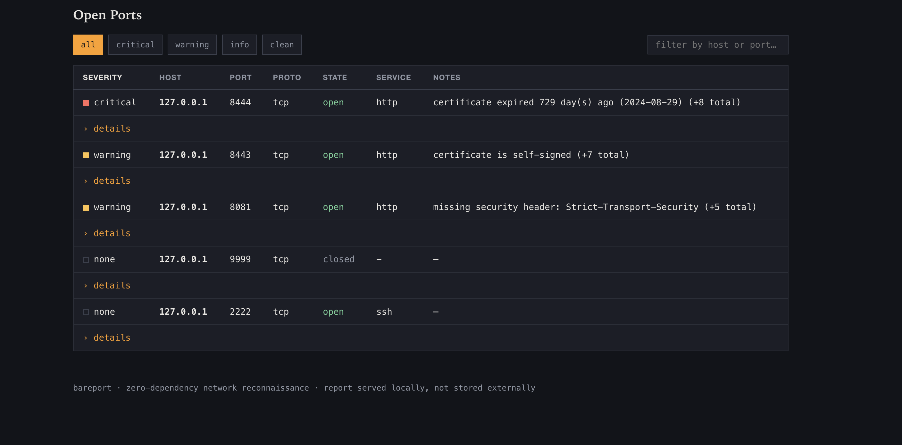

</td>
</tr>

<tr>
<td width="50%">

**Finding Filters**

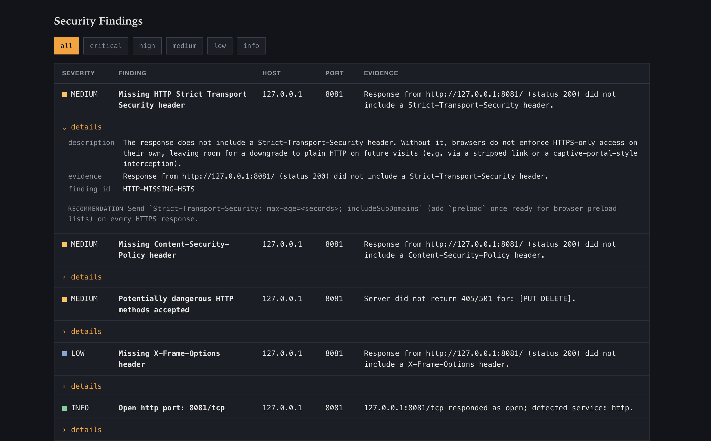

</td>
<td width="50%">

**Live Scanning**

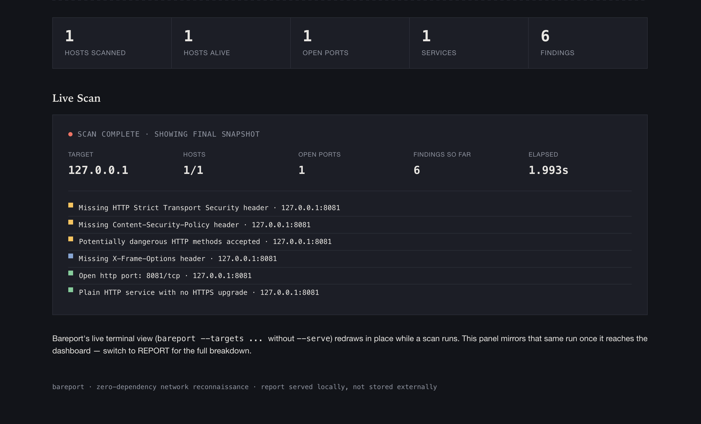

</td>
</tr>
</table>

### HTML Report

The self-contained HTML report provides a clear security assessment with risk scoring, severity breakdowns, findings, attack-surface information, and light/dark viewing modes.

<div align="center">

<table>
<tr>
<td align="center" width="50%">
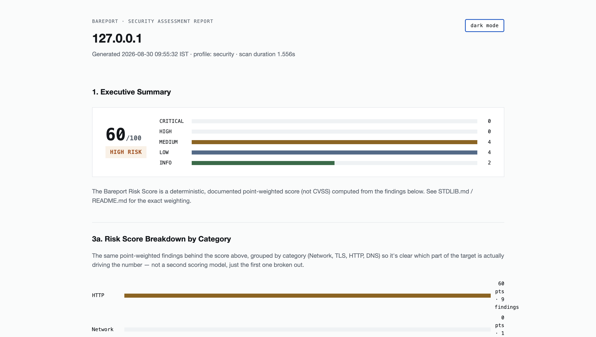
<br><sub><b>Light Mode</b></sub>
</td>

<td align="center" width="50%">
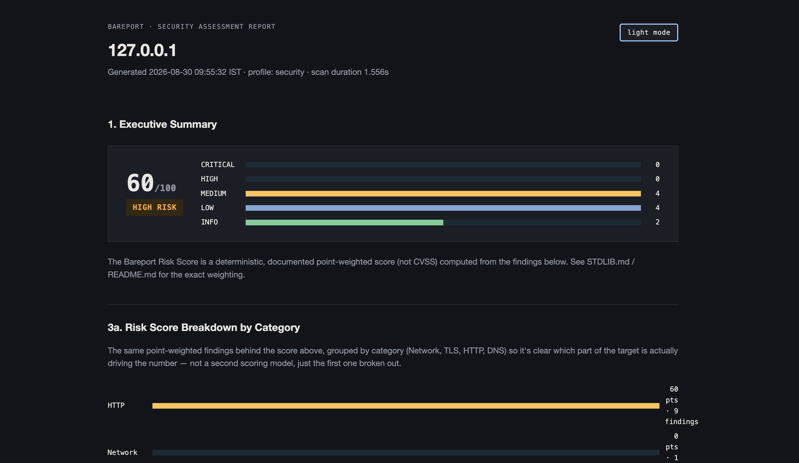
<br><sub><b>Dark Mode</b></sub>
</td>
</tr>

<tr>
<td align="center" width="50%">
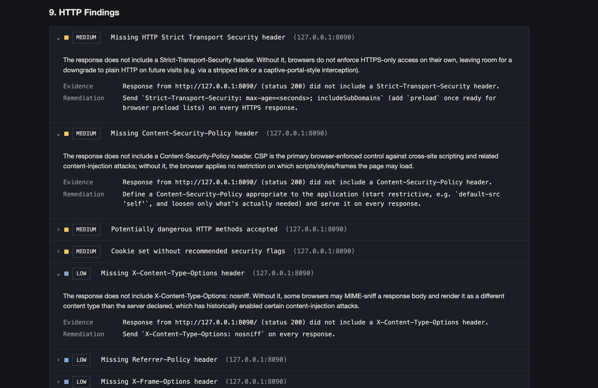
<br><sub><b>Dark Mode — Alternate View</b></sub>
</td>

<td align="center" width="50%">
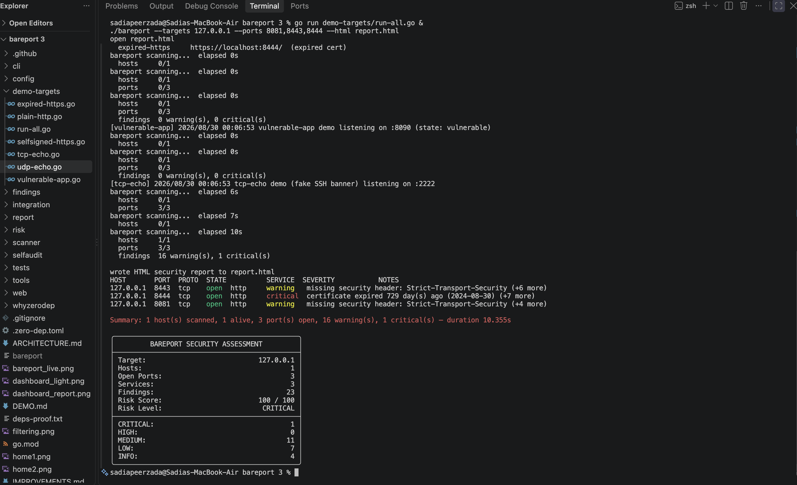
<br><sub><b>Security Assessment</b></sub>
</td>
</tr>
</table>

</div>

### Dashboard

<div align="center">

<table>
<tr>
<td align="center" width="50%">
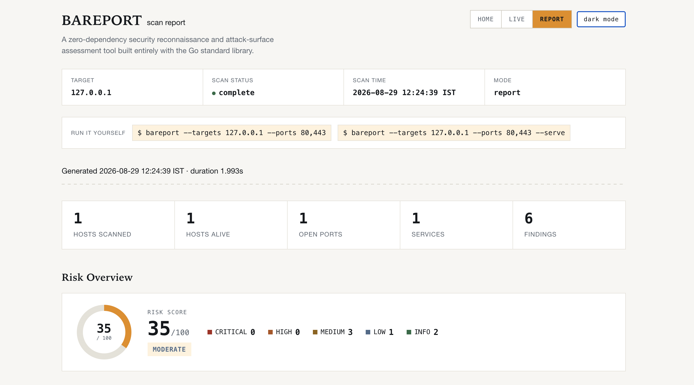
<br><sub><b>Light Theme</b></sub>
</td>

<td align="center" width="50%">
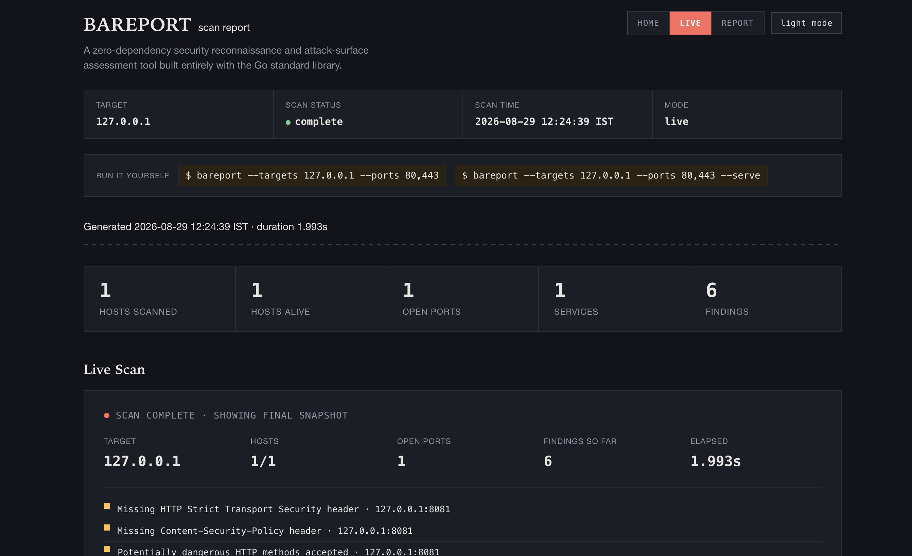
<br><sub><b>Live Dashboard</b></sub>
</td>
</tr>

<tr>
<td align="center" width="50%">
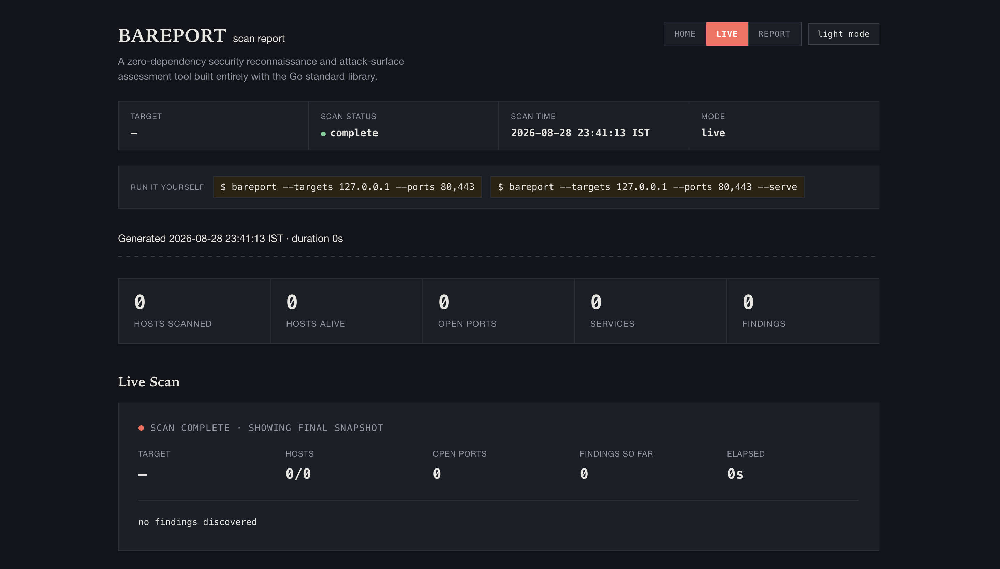
<br><sub><b>Live Scan</b></sub>
</td>

<td align="center" width="50%">
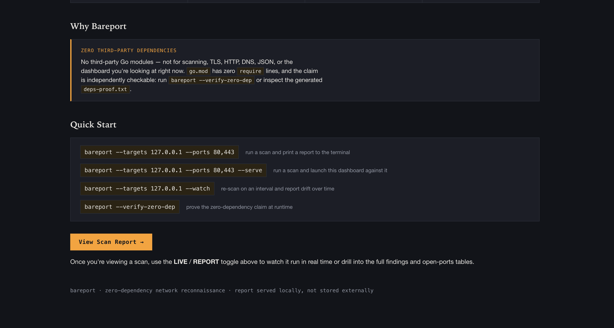
<br><sub><b>Additional Dashboard View</b></sub>
</td>
</tr>
</table>

</div>
## Reports

```bash
bareport --targets example.com --json > report.json    # see schema below
bareport --targets example.com --csv  > report.csv      # flat port-level export
bareport --targets example.com --format sarif > report.sarif  # SARIF 2.1.0
bareport --targets example.com --html report.html       # self-contained, offline-safe
bareport --targets example.com --minimal                 # compact terminal output
bareport --targets example.com --serve                   # local web dashboard
bareport --targets example.com --verbose 2>scan.log       # structured JSON logs (log/slog) on stderr
```

The HTML report is a single file — inline CSS and vanilla JS only, no
external stylesheet, font, CDN script, or framework, no network fetch
of any resource. It opens and renders identically offline. Sections:
executive summary, risk score, risk score breakdown by category,
attack surface, hosts, open ports, services, TLS/HTTP/DNS findings,
evidence, recommendations, scan metadata (including a live
zero-dependency self-audit status). A dark/light theme toggle (top
right, persisted via `localStorage`, defaulting to the OS preference
on first open) mirrors the same toggle in the `--serve` dashboard —
same mechanism, own steel-blue accent kept distinct from the
dashboard's amber so each output still reads as its own thing.

`--format sarif` maps CRITICAL/HIGH → `error`, MEDIUM → `warning`, LOW
→ `note`, INFO → `none` (SARIF has no fifth level, so CRITICAL and HIGH
collapse together — the one lossy step in an otherwise direct mapping).
This is what lets a scan upload straight into a repo's Security tab via
`github/codeql-action/upload-sarif`.

`.github/workflows/sarif-scan.yml` exercises exactly that pipeline in
this repo: it builds bareport, scans `demo-targets/vulnerable-app.go`
(the safe, deterministic, local-only demo target — see DEMO.md; this
workflow never scans a third-party host), and uploads the resulting
SARIF to this repo's Security tab. Runs on push to `main`, on pull
requests (upload skipped for forked-repo PRs, which don't carry
`security-events: write` — a GitHub Actions permission boundary, not
a workflow choice), weekly on a schedule, and on manual dispatch.

<details>
<summary><strong>JSON schema</strong></summary>

```json
{
  "started_at": "...", "duration_ns": 0, "hosts": [...], "summary": {...},
  "target": "example.com",
  "scan": { "targets": [...], "profile": "security", "started_at": "...", "duration": "..." },
  "services": [{ "host": "...", "port": 443, "protocol": "tcp", "service": "http" }],
  "findings": [{ "id": "TLS-EXPIRED-CERT", "severity": "CRITICAL", "title": "...", "description": "...", "evidence": "...", "target": "...", "port": 443, "remediation": "..." }],
  "risk": { "score": 68, "level": "HIGH", "counts": { "critical": 1, "high": 2, "medium": 3, "low": 4, "info": 2 } }
}
```

`started_at`/`duration_ns`/`hosts`/`summary` are the original,
pre-existing fields, kept exactly as they were (via Go struct
embedding) so anything that already parsed bareport's JSON output
keeps working unchanged. Everything else is additive.
</details>

## Baseline / drift detection

```bash
bareport --targets 192.168.1.20 --save baseline.json
#  ... time passes, or a change is made ...
bareport --targets 192.168.1.20 --save current.json
bareport diff baseline.json current.json
```

```
SECURITY DRIFT DETECTED
────────────────────────────────

+ PORT 8080 opened (192.168.1.20)
+ SERVICE nginx detected on 192.168.1.20:8080
+ NEW HIGH finding: ...

- PORT 22 closed (192.168.1.20)

Risk:
Baseline: 24 (MODERATE)
Current:  61 (HIGH)

Change: +37
```

Diffs ports, services, findings, risk score, and TLS certificates with
plain Go map/slice comparisons — no diffing library involved.

### Continuous mode (`--watch`)

The same diff engine, run on a timer instead of by hand:

```bash
bareport --targets 192.168.1.20 --watch --interval 30s
```

Real output from a demo-targets run (port 9191 closed mid-run):

```
bareport watch: re-scanning every 6s (Ctrl+C to stop)

[02:56:45] initial scan:

HOST       PORT  PROTO  STATE  SERVICE  SEVERITY  NOTES
127.0.0.1  9191  tcp    open   http     warning   missing security header: Strict-Transport-Security (+5 more)
...
Summary: 1 host(s) scanned, 1 alive, 5 port(s) open, 21 warning(s), 1 critical(s) — duration 6.035s

[02:56:55] re-scan #2 — drift detected:

SECURITY DRIFT DETECTED
────────────────────────────────

- PORT 9191 closed (127.0.0.1)
- SERVICE http no longer detected on 127.0.0.1:9191
- RESOLVED MEDIUM finding: Missing HTTP Strict Transport Security header (127.0.0.1:9191)
- RESOLVED INFO finding: Open http port: 9191/tcp (127.0.0.1:9191)

Risk:
Baseline: 100 (CRITICAL)
Current:  100 (CRITICAL)

Change: +0
```

An unchanged re-scan prints one quiet line instead of the full report
(`re-scan #3 — no changes (risk 100/100, CRITICAL)`), so a long-running
`--watch` session stays readable — the full drift breakdown only
appears when something actually changed. `Ctrl+C` stops cleanly at any
point, same signal handling as a normal scan.

## Scan profiles

| Profile | Ports | DNS | TLS/HTTP | OS fingerprint | Use case |
|---|---|---|---|---|---|
| `quick` | top100 | off | on | off | fast triage |
| `security` | top1000 | on | on | off | standard assessment |
| `full` | top1000 | on | on | on | deep audit |

`--profile security` is also what running bareport with no `--profile`
flag gets you. `config.Default()` builds its scan behavior from
`ApplyProfile(cfg, "security")` directly, so an unflagged scan and an
explicit `--profile security` scan produce the same ports/DNS/TLS/HTTP/
fingerprint settings — the two can't drift apart the way an earlier,
hand-duplicated default could. Non-scan knobs (worker count, timeouts,
output format) are still set independently in `Default()`, since
profiles don't touch those. Profiles are otherwise documented shorthand
over individual flags — they don't add scanning logic of their own.
See `config.ApplyProfile` and `config.Default` (`config/config.go`)
for the exact flag combination each one sets.

Beyond the three built-in profiles, `--save-config <file>` writes the
fully-resolved config (every flag's effective value, not just what you
passed) to a JSON file and exits without scanning; `--config <file>`
loads it back on a later run, overlaying it onto the defaults so any
field the file doesn't set falls back to `config.Default()`'s value
rather than zeroing out. Useful for a scan configuration you run
repeatedly without retyping every flag:

```bash
bareport --targets 10.0.0.0/24 --profile full --workers 200 --save-config lan-audit.json
bareport --config lan-audit.json   # re-run the exact same scan later
```

## Zero-dependency philosophy

```bash
make deps-proof          # go list -m all -> one line: this module
make verify-reproducible # builds twice (stripped, -trimpath), sha256s both, asserts byte-identical
make test-race            # go test -race
bareport why-zero-dep    # substitution list, from the CLI itself
bareport --verify-zero-dep # runtime import-graph audit, from the binary itself
```

`make deps-proof` is the whole claim in one line:

```
$ go list -m all
bareport
```

`bareport --verify-zero-dep` is the same claim, made by the running
binary instead of the build tooling — see [Signature features](#signature-features)
for the full walkthrough.

`golang.org/x/*` is never imported anywhere in this project.
Race-detector clean under concurrent scanning, including the two most
goroutine-heavy paths: the worker pools in `scanner/tcp.go`/`udp.go`
and the ticker/mutex-shared state in `report/live.go`. Full
substitution table (19 entries) and the honest trade-offs behind each:
**[STDLIB.md](./STDLIB.md)**.

> [!TIP]
> The hackathon wants dependency proof a judge can confirm without running anything. `deps-proof.txt` at the repo root carries the combined output of `make deps-proof`, `bareport --verify-zero-dep`, and `make verify-reproducible` — that's the exact filename their own example submission layout uses.

```
$ make verify-reproducible
build A sha256: 1d245c108bae7e29f0f80d94f1c6a7f6093546ae1b8057433c86573439ba7da8
build B sha256: 1d245c108bae7e29f0f80d94f1c6a7f6093546ae1b8057433c86573439ba7da8
OK: both builds are byte-identical
```

(Re-run it yourself any time — `make verify-reproducible` builds twice
and diffs the hashes fresh. The specific hex string above is this
machine's current build; what the claim actually promises is that two
builds *on the same machine* always match each other, not that the
hash is a portable constant across every environment — different Go
patch versions or build paths can legitimately produce a different,
still internally-consistent, hash.)

## Demo environment

`demo-targets/` ships six minimal, self-contained servers exercising
every scanning feature without real external hosts:

| target | port | demonstrates |
|---|---|---|
| `plain-http.go` | 8081 | header audit |
| `selfsigned-https.go` | 8443 | self-signed cert detection |
| `expired-https.go` | 8444 | expired cert detection (critical) |
| `tcp-echo.go` | 2222 | banner grabbing (fake SSH banner) |
| `udp-echo.go` | 9999 | UDP scanning |
| `vulnerable-app.go` | 8090 | BEFORE/AFTER fix-rescan demo: missing headers, Server-header info disclosure, insecure cookie, exposed `/admin` — toggle via `/_bareport_demo/fix` and `/reset` |

```bash
go run demo-targets/run-all.go
make integration-test   # black-box: real binary against real demo-target binaries
make demo-fix-rescan    # scan vulnerable-app.go, flip it to fixed over HTTP, rescan, then `bareport diff` the two
```

`make demo-fix-rescan` runs the full BEFORE → FIX → RESCAN → VERIFY
cycle end to end against a real running server: builds the real
`bareport` binary and the real `vulnerable-app` binary (not `go run`),
scans it in its default vulnerable state, calls its own
`/_bareport_demo/fix` endpoint to flip it to the fixed state, rescans,
and runs the real `bareport diff` between the two saved assessments —
nothing in that sequence is simulated or pre-recorded.

`integration/main.go` builds and runs the real `bareport` binary
against real demo-target binaries (not `go run` subprocesses), and
asserts on actual CLI output and exit codes — catching wiring bugs
in-process unit tests can't.

```
BAREPORT INTEGRATION TEST

[PASS] JSON output
[PASS] TCP detection
[PASS] UDP detection
[PASS] HTTP fingerprint
[PASS] TLS certificate detection
[PASS] Expired certificate detection
[PASS] HTTP security headers
[PASS] Finding engine
[PASS] Risk engine
[PASS] HTML report
[PASS] Baseline diff
[PASS] Fix -> Rescan -> Verify

12/12 PASS
```

## Testing

```bash
go test ./...
go test -race ./tests/...
go test -bench=. -benchtime=3x ./tests/
go test ./tests/... -coverpkg=./... -cover
make integration-test
```

**Coverage: 84.1%** — the real cross-package figure
(`-coverpkg=./...`), not the misleading per-package number
`go test -cover ./...` alone reports for a separate `tests` package.
Measured, not retrofitted: 28.3% → 41.2% → 52.6% → 54.9% → 61.3% →
71.1% → 76.3% → 76.1% → 67.5% → 77.4% → 84.5% → 84.1% (real current
figure, re-measured from a clean rebuild with the exact command above;
treat this as the authoritative number over the older figures still
visible in this progression — the dip from 84.5% reflects genuinely
new, not-yet-fully-covered code added for features #3/#4/#5/#6/#7/#9,
not a regression in existing coverage) across rounds of work — the last jumps
specifically targeted the documented gaps below: `scanner.enrichPortResult` (the
open-port TLS/HTTP/banner enrichment path, previously only reachable
through closed-port CLI runs), TLS handshake-failure and
hostname/cert-metadata paths, HTTP dangerous-methods and
HTTPS-upgrade-redirect detection, the web dashboard's `Serve` startup/
shutdown/listen-failure paths (now unit-tested against real local
sockets, not just `Handler()` via `httptest`), `selfaudit.Verify`'s
FAILED branch (via temporarily substituting the package-level
`ownImports` var in an in-package test — see
`selfaudit/selfaudit_internal_test.go` — never the generated manifest
itself), and a pass through `report`'s and `web`'s small unexported
severity/color/CSS-class helpers.

**Known, disclosed gaps:** live DNS lookup path (`net.Resolver` has no
dependency-injectable transport in the stdlib), the raw-socket TTL read
behind OS fingerprinting, and the live terminal dashboard's redraw loop
— all exercised by `make integration-test` and manual testing, not per-function unit
coverage. See the Testing section of **[IMPROVEMENTS.md](./IMPROVEMENTS.md)**
for what's being tracked to close these gaps.

## Performance

500-port scan against a live loopback listener, varying worker-pool size:

| Workers | ms/op | allocs/op |
|---|---|---|
| 10 | 7.08 | 11,540 |
| 50 | 7.41 | 11,580 |
| 100 | 8.28 | 11,637 |
| 500 | 11.46 | 12,431 |

Throughput gets *worse* as the worker pool grows — **on this
benchmark specifically**, because loopback connections resolve in
microseconds, so there's no network wait for extra workers to hide
behind; more goroutines just add scheduling overhead against a
bottleneck that was never I/O wait. Against a real, latency-bearing
network target the picture inverts — more workers means more in-flight
connections hiding real round-trip latency, which is what `--workers`
exists to tune. This benchmark measures the worker-pool machinery's own
overhead, not real-world scan throughput; the two are not the same
number.

## Limitations

- **UDP scanning** can't distinguish open-and-silent from
  filtered-and-dropped without protocol-specific payloads —
  `open|filtered` is the honest answer for most UDP ports.
- **Host discovery** is TCP-based, not ICMP — a host with every
  discovery port firewalled looks "dead." `--skip-discovery` bypasses
  the check entirely.
- **OS fingerprinting** is a TTL heuristic, trivially spoofable, and
  Linux-only.
- **The risk score** is bareport's own model — not CVSS, not aligned to
  any industry-standard framework, not validated against real-world
  exploitability data.
- **The findings engine** only fires on signals bareport itself
  collects; it's not a CVE-backed vulnerability scanner and doesn't
  claim to be.
- **Test coverage** is 84.1%, with specific documented gaps (above),
  not blanket "everything is tested."
- **`--verify-zero-dep`** checks bareport's own module against the
  embedded stdlib list; it doesn't (and can't) verify a downstream
  fork that vendors code into `src/` without updating that table.
- **TTY detection on Windows** falls back to a `os.ModeCharDevice`-only
  check (see `report/tty_other.go`), which can't distinguish a real
  terminal from `/dev/null`-equivalent devices — Windows has no
  ioctl-based terminal check to reimplement without a console-mode API
  dependency. Linux and darwin both use a genuine ioctl-based check
  (`TCGETS`/`TIOCGETA`) with no such false positive.

## Troubleshooting

| Symptom | Fix |
|---|---|
| `--verify-zero-dep` fails with an unexpected import | Run `go mod tidy` and re-check `go.mod` for a stray `require` line — see [Contributing](#contributing) for the zero-dep rule |
| OS fingerprinting silently does nothing | It's Linux-only (raw-socket TTL read) — expected behavior on macOS/Windows, not a bug; see [Limitations](#limitations) |
| UDP port shows `open\|filtered` instead of a clean state | Expected — UDP can't distinguish the two without protocol-specific payloads, see [Limitations](#limitations) |
| Host shows as "dead" but you know it's up | Discovery is TCP-based, not ICMP; a host with every discovery port firewalled looks dead. Use `--skip-discovery` |
| `make build` fails on macOS/Windows | Those targets are build-verified, not run-verified (development is primarily on Linux) — file an issue with the exact error |
| `--serve` port already in use | Another process (possibly a previous `bareport --serve`) is bound to it — pick a different port or kill the existing process |
| `bareport diff` shows no changes you expected | Confirm both `--save` files came from scans with the same `--ports`/`--profile` — diff only compares what both scans actually collected |
| HTML report references look broken when opened offline | Shouldn't happen — the report is single-file with no external fetches; if it does, that's a real bug, not a config issue |

## Project structure

```
bareport/
├── .github/workflows/   ci.yml (build/vet/test/race/integration) + sarif-scan.yml (feature #9)
├── .zero-dep.toml       Track C metadata (track + pitch)
├── Makefile             build / deps-proof / verify-reproducible / test / integration-test / demo
├── main.go              trivial entry point — os.Exit(cli.Run(...)); see cli/ for the real logic
├── cli/                 flag parsing, subcommand dispatch, output-mode wiring
├── scanner/             the scanning engine — see STDLIB.md for the "why" per file
├── findings/            deterministic security-finding rules (TLS/HTTP/network)
├── risk/                the Bareport Risk Score (not CVSS) + category breakdown
├── report/              table/JSON/CSV/HTML output, diff + drift, live dashboard, attack-surface view
├── web/                 embedded local dashboard (html/template + go:embed)
├── config/              scan config struct, JSON profile load/save
├── whyzerodep/          content behind `bareport why-zero-dep`
├── selfaudit/           embedded stdlib table + import-graph walk behind `--verify-zero-dep`
├── tools/               build-time generators only (gen_selfaudit.go), never part of `go build .`
├── demo-targets/        standalone demo servers + run-all.go
├── integration/         black-box integration test lab
├── tests/               unit tests + benchmark
├── STDLIB.md            package-by-package substitution rationale
├── ARCHITECTURE.md      pipeline + package responsibilities
├── SECURITY.md          authorized use, data handling, disclosure
├── DEMO.md              shot-by-shot demo video script
├── IMPROVEMENTS.md      prioritized list of open improvement areas
├── LICENSE              license terms
└── go.mod               zero require lines
```

## Security / authorized use

> [!WARNING]
> Bareport actively probes network hosts and services. **Only run it against hosts and networks you own or have explicit authorization to test.** Unauthorized scanning may violate computer-crime laws, terms of service, or acceptable-use policies depending on your jurisdiction and the target — that responsibility is yours, not the tool's.

Full policy, data handling, and disclosure process: **[SECURITY.md](./SECURITY.md)**.

## Contributing

Bareport's whole value proposition rests on the zero-dependency
constraint, so that's the one hard rule for contributions: **no new
`require` lines, ever** — if something needs a package that isn't in
the Go standard library, the answer is to find a stdlib-only way to do
it or leave it out. Beyond that:

1. Run `make deps-proof` and `bareport --verify-zero-dep` before
   opening a PR — both should still pass clean.
2. Run `go test -race ./...` and `make integration-test` — both should
   pass clean.
3. If you touch a finding rule, add a test asserting the evidence and
   remediation text for that rule.
4. If you change behavior the README documents (exit codes, flag
   defaults, report schema), update the README in the same PR.

See **[IMPROVEMENTS.md](./IMPROVEMENTS.md)** for a prioritized list of
open improvement areas if you're looking for where to start.

## License

See [`LICENSE`](./LICENSE) for terms.
